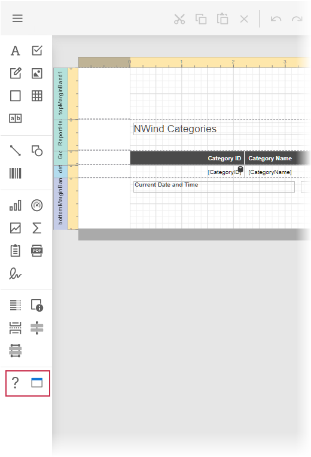

<!-- default badges list -->

<!-- default badges end -->
# Reporting for ASP.NET Core - Create a Custom Report Control

This example demonstrates how to create a custom report control and add it to the End-User Report Designer toolbox.

## Files to Review

- [MyControl.cs](./CustomControlExample/CustomControls/MyControl.cs)
- [NumericLabel.cs](./CustomControlExample/CustomControls/NumericLabel.cs)
- [Index.cshtml](./CustomControlExample/Views/Home/Index.cshtml)

## Documentation

- [Create and Register a Custom Control in the Report Designer Toolbox (ASP.NET Core)](https://docs.devexpress.com/XtraReports/402553/web-reporting/asp-net-core-reporting/end-user-report-designer-in-asp-net-applications/customize-the-report-designer/customize-the-report-designer-toolbox)

## More Examples

- [How to Create a Custom DevExpress Report Control](https://github.com/DevExpress-Examples/Reporting-Custom-Controls)
- [Reporting for Web Forms - Create a Custom Report Control](https://github.com/DevExpress-Examples/reporting-web-custom-control-designer-toolbox)
- [Reporting for ASP.NET MVC - Create a Custom Report Control](https://github.com/DevExpress-Examples/Reporting-AspNetMvc-Create-Custom-Control)
<!-- feedback -->
## Does this example address your development requirements/objectives?

 

(you will be redirected to DevExpress.com to submit your response)
<!-- feedback end -->
